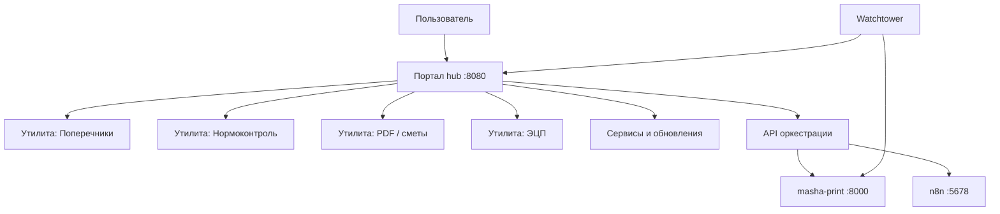

# Архитектура портала управления

## Концепция

## Принципы UI

1. **Одна главная** — карточки утилит, версия портала, баннер обновления.
2. **Единая тема** — тёмный фон, акцент `#38bdf8`, карточки с border-radius 16–20px.
3. **Сервисы отдельно** — страница `/services`: статус контейнеров, не смешивать с утилитами.
4. **Не дублировать логику** — тяжёлые операции только через API микросервисов.

## Страницы портала (текущие)

| Путь | Назначение |
|------|------------|
| `/` | Хаб утилит |
| `/services` | Контейнеры, версии, Watchtower |
| `/calc` | Поперечники / DXF |
| `/norm` | Пакетный нормоконтроль |
| `/verify` | Проверка ЭЦП |
| `/pdf` | Конвейер PDF → сметы |

## Автообновление

- Образы: `makeden/geo_calc_app:latest`, `makeden/masha-print:latest`
- Метка Docker: `com.centurylinklabs.watchtower.enable=true`
- Токен: `WATCHTOWER_TOKEN` (общий для портала и Watchtower)
